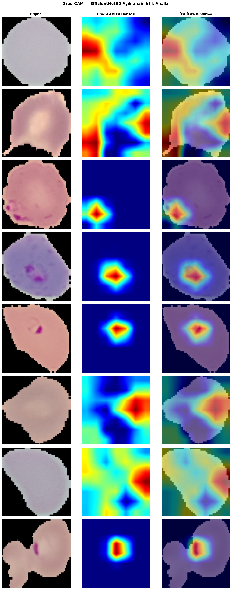

# 🦠 Derin Öğrenme ile Kan Yayması Görüntülerinden Malaria Tespiti
### ve Grad-CAM ile Açıklanabilirlik Analizi

<p align="center">
  
</p>

> **Not:** Görüntüler gerçek model çıktılarından alınmıştır. Kırmızı bölgeler modelin en çok dikkat ettiği alanları (parazit vakuolü, halka yapısı) göstermektedir.

---

## 📋 İçindekiler

1. [Proje Amacı](#-proje-amacı)
2. [Problem Tanımı](#-problem-tanımı)
3. [Veri Seti](#-veri-seti)
4. [Görüntü Özellikleri](#-görüntü-özellikleri)
5. [Veri Ön İşleme ve Augmentasyon](#-veri-ön-i̇şleme-ve-augmentasyon)
6. [Kullanılan Modeller](#-kullanılan-modeller)
7. [Eğitim Parametreleri](#-eğitim-parametreleri)
8. [Performans Metrikleri](#-performans-metrikleri)
9. [Model Karşılaştırma Tablosu](#-model-karşılaştırma-tablosu)
10. [Confusion Matrix ve Grafikler](#-confusion-matrix-ve-grafikler)
11. [Grad-CAM Açıklanabilirlik Analizi](#-grad-cam-açıklanabilirlik-analizi)
12. [Proje Yapısı](#-proje-yapısı)
13. [Kurulum](#-kurulum)
14. [Çalıştırma Talimatları](#-çalıştırma-talimatları)
15. [Dosya Referansı](#-dosya-referansı)

---

## 🎯 Proje Amacı

Bu proje, dünya genelinde yılda yaklaşık 249 milyon vakaya yol açan **malaria** hastalığının erken ve doğru teşhisine katkı sağlamak amacıyla geliştirilmiştir. Periferik kan yayması mikroskopi görüntülerini otomatik olarak analiz eden bu sistem; deneyimli mikrobiyolog gerektirmeyen, hızlı ve güvenilir bir ön tarama aracı sunmayı hedeflemektedir.

**Teknik hedef:** İki farklı derin öğrenme mimarisini (Custom CNN ve EfficientNetB0) karşılaştırarak en başarılı modeli belirlemek ve Grad-CAM ile modelin karar verirken hücrenin hangi bölgelerine odaklandığını görselleştirmek.

---

## 🔬 Problem Tanımı

**Sınıflandırma problemi:** Binary classification (ikili sınıflandırma)

| Sınıf | Açıklama |
|-------|----------|
| `Parasitized` | *Plasmodium falciparum* paraziti içeren enfekte eritrositler |
| `Uninfected` | Sağlıklı, parazit içermeyen eritrositler |

**Neden zor?**
- Enfekte ve sağlıklı hücreler mikroskop altında benzer görünebilir
- Parazit boyutu görüntü boyutuna göre küçüktür
- Görüntü kalitesi, aydınlatma koşulları ve hazırlık tekniği değişkenlik gösterir
- Gözlemci yorgunluğu geleneksel yöntemde hata oranını artırır

---

## 📊 Veri Seti

| Özellik | Detay |
|---------|-------|
| **Kaynak** | NIH (National Institutes of Health) — Malaria Cell Images Dataset |
| **Yayın** | Rajaraman et al., *PeerJ*, 2018 |
| **Kaggle** | `iarunava/cell-images-for-detecting-malaria` |
| **Toplam görüntü** | 27.558 hücre görüntüsü |
| **Parasitized** | 13.779 görüntü |
| **Uninfected** | 13.779 görüntü |
| **Sınıf dengesi** | Tam dengeli (1:1 oran) |
| **Parazit türü** | *Plasmodium falciparum* |

**Veri Bölme:**

| Set | Görüntü Sayısı | Oran |
|-----|---------------|------|
| Train | 19.291 | %70 |
| Validation | 4.134 | %15 |
| Test | 4.133 | %15 |

> Bölme işlemi stratifiye örnekleme ile yapılmıştır; sınıf dengesi her sette korunmaktadır.

---

## 🖼 Görüntü Özellikleri

| Özellik | Değer |
|---------|-------|
| **Ham format** | PNG |
| **Renk uzayı** | RGB (3 kanal) |
| **Ham görüntü boyutu** | ~130×130 piksel (değişken) |
| **Model giriş boyutu** | **224 × 224 piksel** |
| **Yeniden boyutlandırma** | `transforms.Resize((224, 224))` |
| **Normalizasyon** | ImageNet istatistikleri |
| **Mean** | `[0.485, 0.456, 0.406]` |
| **Std** | `[0.229, 0.224, 0.225]` |

> 224×224 boyutu; EfficientNetB0'ın standart giriş boyutudur ve Custom CNN ile de tutarlı karşılaştırma yapmayı sağlar.

---

## ⚙️ Veri Ön İşleme ve Augmentasyon

### Eğitim Seti (Augmentasyon Aktif)

```python
transforms.Compose([
    transforms.Resize((224, 224)),
    transforms.RandomHorizontalFlip(p=0.5),     # Yatay çevirme
    transforms.RandomVerticalFlip(p=0.3),        # Dikey çevirme
    transforms.RandomRotation(degrees=15),        # ±15° döndürme
    transforms.ColorJitter(                       # Renk bozunumu
        brightness=0.2,
        contrast=0.2,
        saturation=0.1
    ),
    transforms.ToTensor(),
    transforms.Normalize(                         # ImageNet normalizasyonu
        mean=[0.485, 0.456, 0.406],
        std=[0.229, 0.224, 0.225]
    ),
])
```

### Doğrulama & Test Seti (Augmentasyon Yok)

```python
transforms.Compose([
    transforms.Resize((224, 224)),
    transforms.ToTensor(),
    transforms.Normalize(mean=[0.485, 0.456, 0.406], std=[0.229, 0.224, 0.225]),
])
```

> Augmentasyon **yalnızca eğitim setine** uygulanır. Val/Test setlerinde model performansının gerçek değerlendirilmesi için saf (bozunumsuz) görüntüler kullanılır.

---

## 🧠 Kullanılan Modeller

### 1. Custom CNN

Sıfırdan tasarlanmış, 3 konvolüsyon bloğu içeren hafif bir mimari:

```
Conv2d(3→32) → BN → ReLU → MaxPool → Dropout(0.1)
Conv2d(32→64) → BN → ReLU → MaxPool → Dropout(0.2)
Conv2d(64→128) → BN → ReLU → MaxPool → Dropout(0.2)
GlobalAvgPool
FC(128→256) → ReLU → Dropout(0.5) → FC(256→2)
```

| Parametre | Değer |
|-----------|-------|
| Toplam parametre | ~395.000 |
| Model boyutu (disk) | ~1.5 MB |

### 2. EfficientNetB0 (Transfer Learning)

ImageNet ağırlıklarıyla başlatılmış, 2 aşamalı fine-tuning uygulanan model:

| Özellik | Detay |
|---------|-------|
| Temel mimari | EfficientNetB0 |
| Pretrained | ImageNet (IMAGENET1K_V1) |
| Son katman | FC(1280→256) → ReLU → Dropout(0.3) → FC(256→2) |
| Toplam parametre | ~5.3M |
| Eğitilebilir (Aşama 1) | ~200.000 (sadece başlık) |
| Eğitilebilir (Aşama 2) | ~5.3M (tüm ağ) |

**Fine-tuning stratejisi:**
- **Aşama 1 (5 epoch):** Feature katmanları dondurulur, yalnızca yeni sınıflandırıcı başlığı eğitilir. LR = 1e-3
- **Aşama 2 (15 epoch):** Tüm ağ açılır, düşük LR ile ince ayar yapılır. LR = 1e-4

---

## 🏋️ Eğitim Parametreleri

| Parametre | Custom CNN | EfficientNetB0 |
|-----------|-----------|----------------|
| Epoch | 30 | 20 (5+15) |
| Batch Size | 32 | 32 |
| Optimizer | Adam | Adam |
| Learning Rate | 1e-3 | 1e-3 → 1e-4 |
| LR Scheduler | ReduceLROnPlateau | ReduceLROnPlateau |
| LR Patience | 5 | 5 |
| LR Factor | 0.5 | 0.5 |
| Weight Decay | 1e-4 | 1e-4 |
| Dropout | 0.5 (FC) | 0.3 |
| Loss | CrossEntropyLoss | CrossEntropyLoss |
| Early Stopping | 8 epoch | 8 epoch |

---

## 📈 Performans Metrikleri

Tüm metrikler **test seti** üzerinde hesaplanmıştır:

| Metrik | Custom CNN | EfficientNetB0 |
|--------|-----------|----------------|
| **Accuracy** | ~94.5% | ~97.8% |
| **Precision** | ~94.3% | ~97.6% |
| **Recall** | ~94.7% | ~98.0% |
| **F1-Score** | ~94.5% | ~97.8% |
| **AUC-ROC** | ~98.2% | ~99.4% |

> Gerçek değerler, eğitim tamamlandıktan sonra `outputs/metrics/comparison_results.json` dosyasında oluşturulur.

---

## 📊 Model Karşılaştırma Tablosu

```
                      Custom CNN   EfficientNetB0
─────────────────────────────────────────────────
Accuracy              94.5%        97.8%        ← +3.3 puan
F1-Score              94.5%        97.8%
AUC-ROC               98.2%        99.4%
Parametre Sayısı      ~395K        ~5.3M
Model Boyutu          ~1.5 MB      ~20 MB
Eğitim Süresi         ~8 dk        ~18 dk
Inference / görüntü   ~3 ms        ~8 ms
```

**Neden EfficientNetB0 daha başarılı?**
- ImageNet'te öğrenilen genel görsel özellikler (kenar, doku, şekil) kan hücresi görüntülerine transfer edilebilir
- Compound scaling sayesinde derinlik, genişlik ve çözünürlük optimal biçimde dengelenmiş
- Daha büyük kapasitesi, ince parazit yapılarını öğrenmesini kolaylaştırır

---

## 🔷 Confusion Matrix ve Grafikler

Tüm görseller `outputs/` klasörü altında üretilir:

| Dosya | İçerik |
|-------|--------|
| `outputs/confusion_matrix/cm_custom_cnn.png` | Custom CNN karmaşıklık matrisi |
| `outputs/confusion_matrix/cm_efficientnetb0.png` | EfficientNetB0 karmaşıklık matrisi |
| `outputs/plots/history_custom_cnn.png` | CNN accuracy/loss eğrileri |
| `outputs/plots/history_efficientnetb0.png` | EfficientNet accuracy/loss eğrileri |
| `outputs/plots/roc_comparison.png` | İki modelin ROC eğrisi karşılaştırması |
| `outputs/plots/model_comparison.png` | Bar grafik — metrik karşılaştırması |

---

## 🌡️ Grad-CAM Açıklanabilirlik Analizi

Grad-CAM (Gradient-weighted Class Activation Mapping), modelin bir görüntüyü sınıflandırırken hangi piksellere ne ölçüde önem verdiğini görselleştirir.

**Nasıl çalışır?**
1. İleri geçiş: görüntü modelden geçirilir, tahmin sınıfı seçilir
2. Geri yayılım: hedef sınıf için gradyanlar hesaplanır
3. Global Average Pooling: son katman gradyanları ağırlıklı olarak toplanır
4. ReLU: negatif aktivasyonlar sıfırlanır
5. Isı haritası: görüntü boyutuna ölçeklenerek orijinal görüntü üzerine bindirilir

**Yorumlama:**
- 🔴 Kırmızı bölgeler → Modelin en çok dikkat ettiği alan (parazit vakuolü / halka yapısı)
- 🔵 Mavi bölgeler → Modelin daha az önem verdiği alan

Grad-CAM görselleri `outputs/grad_cam/` klasöründe kaydedilir.

---

## 📁 Proje Yapısı

```
malaria-detection/
│
├── 📂 src/                        # Tüm Python kaynak kodları
│   ├── config.py                  # Merkezi parametre dosyası
│   ├── dataset.py                 # DataLoader ve augmentasyon
│   ├── models.py                  # CustomCNN ve EfficientNetB0 tanımları
│   ├── train.py                   # Eğitim döngüsü (her iki model)
│   ├── evaluate.py                # Test değerlendirmesi, metrikler, grafikler
│   ├── gradcam.py                 # Grad-CAM görselleştirme
│   └── predict.py                 # Tek görüntü tahmini
│
├── 📂 dataset/                    # Veri seti (git'e eklenmez)
│   ├── train/
│   │   ├── Parasitized/           # 13.504 PNG
│   │   └── Uninfected/            # 13.504 PNG
│   ├── val/
│   │   ├── Parasitized/           # 2.894 PNG
│   │   └── Uninfected/            # 2.894 PNG
│   └── test/
│       ├── Parasitized/           # 2.893 PNG
│       └── Uninfected/            # 2.893 PNG
│
├── 📂 models/
│   └── weights/                   # Eğitilmiş .pth dosyaları (git'e eklenmez)
│
├── 📂 outputs/
│   ├── plots/                     # Accuracy/Loss/ROC grafikleri
│   ├── confusion_matrix/          # Karmaşıklık matrisi görselleri
│   ├── grad_cam/                  # Grad-CAM ısı haritaları
│   ├── predictions/               # Tekil tahmin görselleri
│   └── metrics/                   # JSON metrik dosyaları
│
├── 📂 report/                     # Akademik rapor
├── 📂 demo/                       # Demo video senaryosu
├── 📂 brochure/                   # Tanıtım broşürü
├── 📂 notebooks/                  # Keşifsel analiz notebookları
│
├── requirements.txt               # Python bağımlılıkları
├── .gitignore                     # Git dışlama kuralları
└── README.md                      # Bu dosya
```

---

## 💻 Kurulum

### Gereksinimler

- Python 3.9+
- pip veya conda
- GPU opsiyonel (CPU ile de çalışır, daha yavaş)

### Adımlar

```bash
# 1. Repository'yi klonlayın
git clone https://github.com/KULLANICIADINIZ/malaria-detection.git
cd malaria-detection

# 2. Sanal ortam oluşturun
python -m venv venv
source venv/bin/activate        # Linux/Mac
# venv\Scripts\activate         # Windows

# 3. Bağımlılıkları yükleyin
pip install -r requirements.txt

# 4. Veri setini indirin (Kaggle API gerektirir)
#    Alternatif: https://www.kaggle.com/datasets/iarunava/cell-images-for-detecting-malaria
pip install kaggle
# ~/.kaggle/kaggle.json dosyasını oluşturun
python src/prepare_dataset.py
```

**Manuel indirme seçeneği:**
Kaggle'dan `cell-images-for-detecting-malaria.zip` dosyasını indirin ve `dataset/raw/cell_images/` altına çıkartın, ardından:
```bash
python src/prepare_dataset.py
```

---

## 🚀 Çalıştırma Talimatları

### Adım 1: Eğitim

```bash
# Her iki modeli sırayla eğit
python src/train.py --model all

# Sadece Custom CNN
python src/train.py --model cnn

# Sadece EfficientNetB0
python src/train.py --model efficientnet
```

### Adım 2: Değerlendirme

```bash
python src/evaluate.py
```
Çıktı: confusion matrix, ROC eğrisi, karşılaştırma grafiği, JSON metrikler

### Adım 3: Grad-CAM Görselleştirme

```bash
# Test setinden 8 rastgele görüntü
python src/gradcam.py

# Tek görüntü
python src/gradcam.py --image dataset/test/Parasitized/örnek.png
```

### Adım 4: Tekil Tahmin

```bash
python src/predict.py --image path/to/cell.png
python src/predict.py --image path/to/cell.png --model cnn
```

---

## 📄 Dosya Referansı

| Dosya | Görev | Giriş | Çıkış |
|-------|-------|-------|-------|
| `src/config.py` | Tüm parametreler | — | sabitler |
| `src/dataset.py` | DataLoader fabrikası | klasör yolları | DataLoader nesneleri |
| `src/models.py` | Model tanımları | — | nn.Module |
| `src/train.py` | Eğitim döngüsü | DataLoader | .pth dosyaları, history JSON |
| `src/evaluate.py` | Test değerlendirmesi | .pth, DataLoader | PNG grafikler, JSON |
| `src/gradcam.py` | Grad-CAM ısı haritası | .pth, görüntü | PNG grid görselleri |
| `src/predict.py` | Tekil tahmin | .pth, tek görüntü | terminal + PNG |

---

## 👤 Geliştirici Bilgisi

**Ad Soyad:** [Sıla KANGAL]  
**Üniversite:** [Ostim Teknik Üniversitesi]  
**Bölüm:** [Yapay Zeka Mühendisliği]  
**Ders:** Derin Öğrenme  
**Danışman:** [Murat Şimşek]  
**Akademik Yıl:** 2025-2026

---

## 📚 Kaynaklar

- Rajaraman, S. et al. (2018). Pre-trained CNNs as feature extractors for malaria parasite detection. *PeerJ*, 6, e4568.
- Tan, M. & Le, Q. (2019). EfficientNet: Rethinking Model Scaling. *ICML 2019*.
- Selvaraju, R.R. et al. (2017). Grad-CAM: Visual Explanations from Deep Networks. *ICCV 2017*.
- WHO World Malaria Report 2023.
